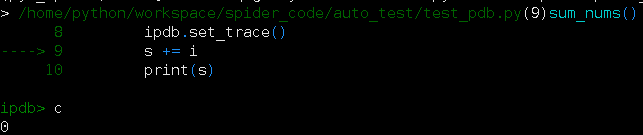

# Auto
### Python自动化项目
#### Python小工具的使用
1. Python调试器ipdb(不用print方法进行调试)

2. sys.argv获取命令行参数
3. 使用sys.stdin和fileinput读取标准输入。
4. getpass库的使用
5. click的使用
    * command:使用函数成为命令行接口；
    * option：增加命令行选项
    * 【default:设置命令行参数的默认值】
    * 【help:参数说明】
    * 【type：参数类型，int】
    * 【prompt:当命令行没有输入对应的值时，会根据prompt提示用户输入】
    * 【nargs:指定命令行参数接受的值的个数】
    * echo：输出结果
6. prompt_toolkit的使用